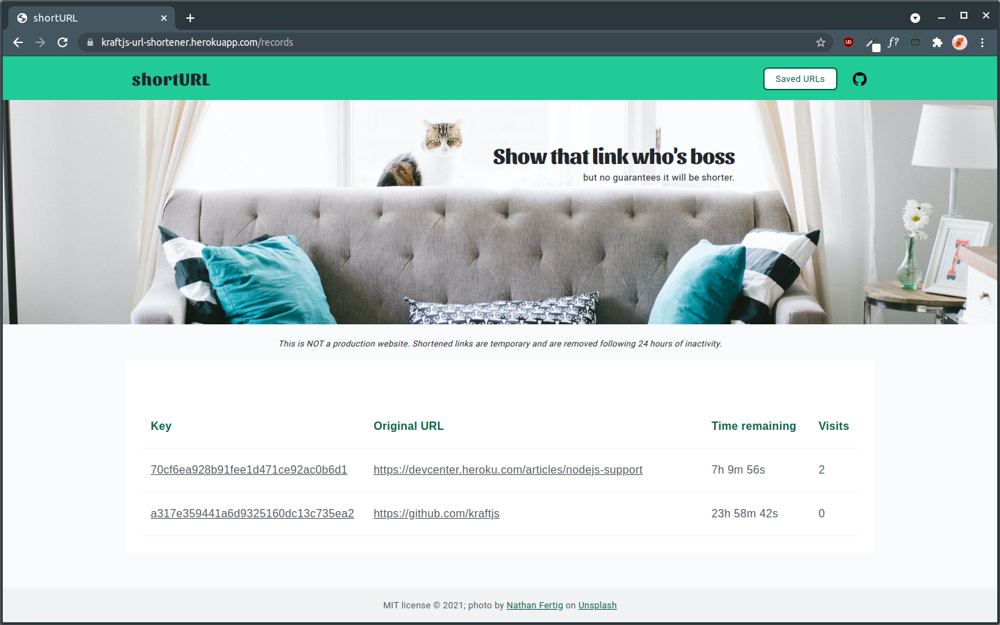

# shortURL
Are you looking for a URL shortening service that probably won't yield a shorter URL? What about one that deletes its records after 24 hours of inactivity? Does this dream website also require a header photo with a cat?  

If this sounds like you, then ~~[shortURL](https://kraftjs-url-shortener.herokuapp.com/)~~(edit: unfortunately, Heroku removed their free hosting tier so this link no longer works) is exactly what you need! Check it out! (Love of cats is purely optional.)

### Features:

* Time-sensitive shortened URLs that delete after 24 hours of inactivity.
* Single record page that displays shortened and orginal URL, unique visits, and time remaining before deletion.
* Table dashboard page that displays all saved URL records and their stats.

### Technologies:

* Built atop Heroku and PostgreSQL.
* Developed using TypeScript, Jest, Express, Knexjs, Handlebars, and SCSS.
* Test coverage is greater than 80% and includes unit, integration and end-to-end tests.

### Images:

